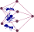

# antani

Ant - agent/network intelligence 

_ants optimizing paths on a network_
## antani description

Agent based optimization, first action: sense

_antani sense_

Occupy a spot

_antani move_

Take an action

_antani carry_

