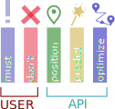
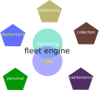
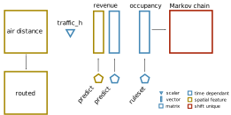

# Optimization

Optimization is finding one optimal configuration for a given system 


_optimization 8 vans_

## workflow

The optimization engine has user controlled and automated modules



_ops application_

We retrieve information directly from the fleet console microservices 


_management console_

We collect the current status with a single api call

```python
resq = requests.get(url=cred['node_url']+"/users/actions/",headers=headers)
resq = requests.get(url=cred['node_url']+"/geodata/zones/",headers=headers)
resq = requests.get(url=cred['node_url']+"/geodata/zones/"+id_zone+"/areas",headers=headers)
resq = requests.get(url=cred['node_url']+"/geodata/areas/deployment/zone",headers=headers,params={"zoneIdentifier":g['zoneIdentifier']})
```

The fleet engine sits in the middle and steers all operations, tracking and monitoring log the current status



_development of objectives_

In the fleet engine 4 objects will be defined with an hierarchical structure 


_metric operations_

The purpose of the optimization engine is to compute profitability for each drive and iterate all over the possible solutions 


_field operation assignement_

For each *drive* is calculated a cost and a rating

For Each *task* is calculated a revenue and a risk

<!-- To enable parallel work we need to move from a graph design -->

<!--  -->
<!-- _engine design, current scheme_ -->

<!-- To a linear design where the engine just orchestrate the calls and there is always a cached table to substitute a broken service -->

<!--  -->
<!-- _engine design, suggested scheme_ -->

# optimization task

We have to find the most efficient distribution tasks among drivers to minimize costs and maximize revenue


_optimization problem_


## routific

We use routific to distribute tasks to drivers


_routific dashboard_

Limitations of routific:

* not improving on revenue
* not optimizing on total drive time
* priority change routes but don't change graphs

## optmimization engine

We need to reduce the drive time and focus on most interesting spots

<!-- <video controls><source src="f_ops/linea.mp4"></video> -->
<!-- _optimization procedure_ -->

### routing efficiency

We first add all the spots a van could see and we calculate the most optimal route connecting the spots


_spot connection_

### spot prioritization

Prediction should define the layers where we are most confident about the revenues for a given time and weather condition

We define the revenue as:


_potential of that area for a given weekday and shift number_

$$ \mu_{deploy}n_{deploy}E_{deploy} + \mu_{collect}n_{collect}E_{collect} $$ 

Where $\mu$ is the potential to add or remove a scooter at a certain spot, $E$ is the revenue per scooter, $n$ is the number of scooters

and the costs as:

$$ l_{ride}c_{lenght} + n_{stops}c_{stops} $$

Where $l$ is the lenght, $n$ the number of stops and $c$ empirical parameters.

### solve problem

We can toggle the activation of the spot and recalculate the energy and apply the Metropolis algorithm to see whether the move is convenient


_optimization graph_

The total energy of the system decreses


_optimization energy_

We consider a larger system 


_larger system_

But after many iteration steps the solution is slowly approaching


_optimization energy, slowly learning_


# Markov chain

To improve the acceptance rate of moves we introduce Markov Chains



_Markov schema_

We multiply the Markov chain matrix with itself to condense iteration probabilities and set up a threshold to consider only the most important links

We calcualte at first a really dense Markov chain (first power) and we increase the power (until five) to have a sparse Markov chain 


_Markov chain densities_

We than use a sparse Markov chain with around 7 links per node


_sparse markov chain_

From the Markov chain we create a cumulative probability which is getting simpler while increasing the number of iterations


_cumulative probability on filtering_

## iterating to the solution

We run over 500 spots and 8 drivers


_optimization 8 vans_

and iterate over different solutions


_optimization 8 vans_

We can control the energy evolution and check the aymptotic behaviour of the curves.


_energy history with 8 vans_

# Theory

sampling from probability from a state x [doc](http://www.stat.ucla.edu/~sczhu/Courses/UCLA/Stat_202C/lecture_note/Ch1_MC_Intro.pdf)

$$ x \tilde \pi(x) $$

High dimensional computing (over all states)

$$c = E[f(x)] = \int \pi(x) f(x) ds $$

optimization

$$ x* = argmax \pi(x) $$

Learning and Bayesian hierarchical modeling for a given parameter set $\Theta$

$$ \Theta * = argmax l(\Theta) ; l(\Theta) = \sum_{i=1}^{n} log p(x_i;\Theta) $$


